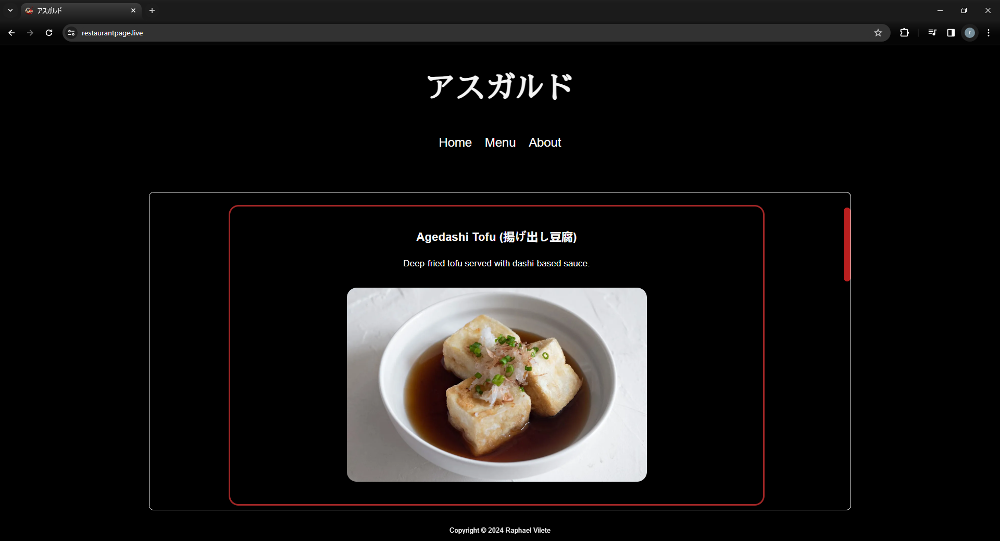

# Restaurant-Page

> Restaurante Japonês

[![Live website][url-image]][url]

    

## Sobre o Projeto

Uma página de restaurante de comida japonesa. Apresenta opções do menu, informações de localização, contato e agenda de horários. Desenvolvida com HTML, CSS e JavaScript.

## Como Contribuir

1. Faça um fork do repositório
2. Crie uma branch para sua feature (`git checkout -b feature/MinhaFeature`)
3. Faça commit das suas mudanças (`git commit -am 'Adiciona uma nova feature'`)
4. Faça push para a branch (`git push origin feature/MinhaFeature`)
5. Abra um Pull Request

## Licença

Este projeto está licenciado sob a Licença MIT - veja o arquivo [LICENSE](LICENSE) para detalhes.

## Contatos

Para mais informações sobre o projeto ou para entrar em contato com os participantes, visite nossa [página de contatos](https://raphaelvilete.tech/#contato).

<!-- Markdown link & img dfn's -->
[url]: https://raphaelvilete.tech/
[url-image]: https://img.shields.io/badge/Live_Website-red
